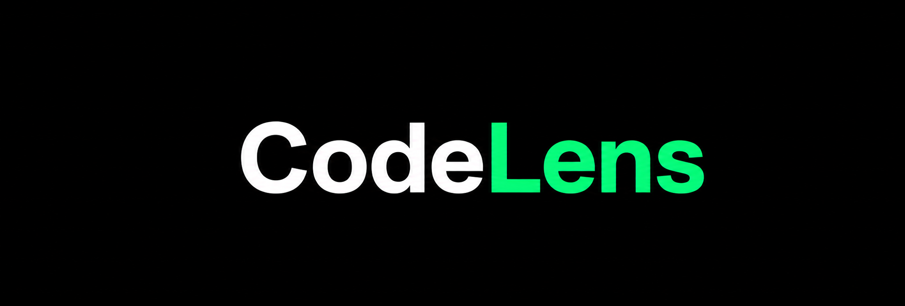
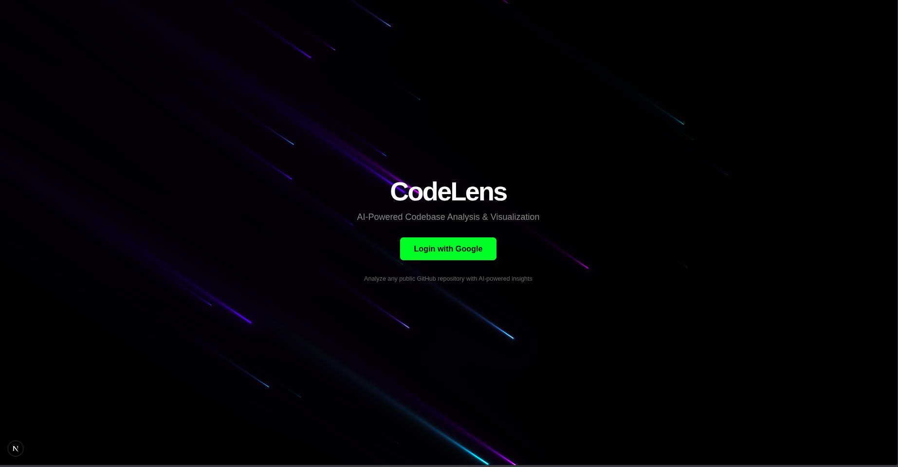
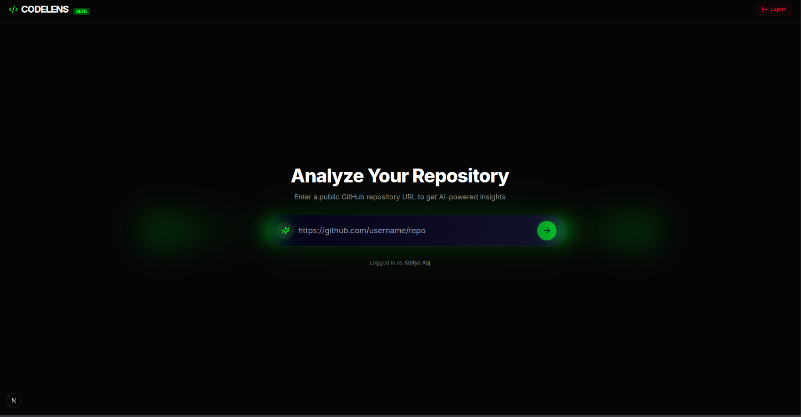
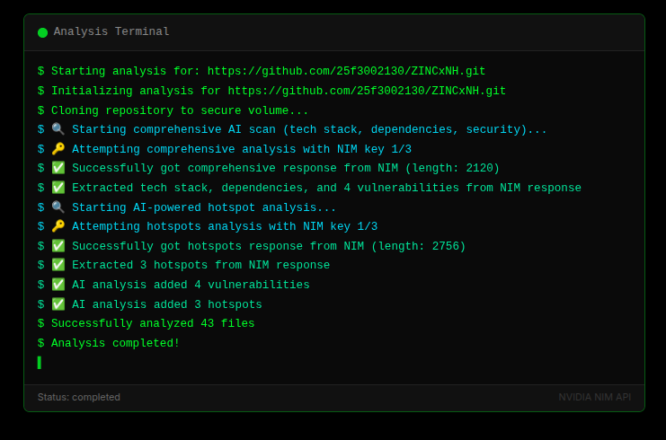

# CODELENS

<p align="center">
  
</p>

<h3 align="center">
AI-Powered Codebase Intelligence & 3D Repository Visualization
</h3>

<p align="center">
Analyze GitHub repositories with AI-driven architecture mapping, hotspot detection, dependency tracking, and semantic code understanding.
</p>

---

# Overview

CodeLens is an AI-powered platform designed to help developers understand complex repositories visually and contextually.

Instead of manually exploring hundreds of files, CodeLens generates:
- Interactive 3D dependency graphs
- Repository architecture insights
- Hotspot detection
- Dependency intelligence
- Tech stack analysis
- AI-assisted repository understanding

The goal is to reduce onboarding friction and make large codebases easier to navigate, debug, and understand.

---

# Demo Screenshots

## Landing Page



---

## Repository Submission Interface



---

## Live Analysis Processing



---

## Analysis Dashboard


---

# Core Features

## Interactive 3D Repository Graph

Visualize repository architecture using dynamic node graphs.

Features:
- File-to-file relationship mapping
- Dependency visualization
- Real-time graph rendering
- Interactive exploration
- Connection tracing
- Modular structure analysis

---

## AI-Powered Repository Intelligence

CodeLens combines semantic analysis with repository parsing to generate contextual insights.

Capabilities:
- Repository understanding
- Context-aware querying
- AI-assisted explanations
- Cross-file relationship analysis
- Intelligent architecture summarization

---

## Hotspot Detection

Automatically identifies:
- Complex modules
- High-risk files
- Frequently connected components
- Potential maintenance bottlenecks
- Circular dependency patterns

---

## Security & Dependency Analysis

Analyze repositories for:
- Suspicious dependency usage
- Dependency relationships
- Structural weaknesses
- Risk-prone modules
- Security-oriented repository insights

---

## Repository Parsing Engine

CodeLens uses AST-based parsing for accurate repository analysis.

Includes:
- Multi-language parsing
- Structural indexing
- File relationship extraction
- Symbol mapping
- Dependency tracking

---

# Tech Stack

| Category | Technologies |
|----------|--------------|
| Frontend | Next.js 14, React, Tailwind CSS |
| Backend | FastAPI, Python |
| Authentication | Firebase Authentication |
| AI Engine | Google Gemini Pro |
| Database | Optional: ChromaDB (disabled by default) |
| Visualization | Three.js, React Force Graph 3D |
| Parsing | Tree-sitter |
| Deployment | Vercel / Docker (planned) |

---

# Architecture

```text
GitHub Repository
        ↓
Repository Cloning
        ↓
AST Parsing (Tree-sitter)
        ↓
Dependency Extraction
        ↓
Vector Embedding + Semantic Indexing
        ↓
AI Processing (Gemini)
        ↓
3D Graph Generation
        ↓
Interactive Analysis Dashboard
```

---

# Current Functionalities

- Google Authentication
- Public GitHub Repository Submission
- Repository Cloning Pipeline
- Initial AST Parsing
- Dependency Extraction
- Basic Hotspot Detection
- Interactive Analysis Dashboard
- AI Chat Interface (WIP)
- 3D Graph Visualization
- Tech Stack Detection

---

# Planned Features

- Advanced AI code explanations
- Multi-language repository support
- Commit history intelligence
- Team collaboration mode
- Live repository monitoring
- Architecture change tracking
- Exportable reports
- Code quality scoring
- Vulnerability classification
- Repository comparison system

---

# Project Structure

```bash
CODELENS/
│
├── client/                 # Next.js Frontend
│   ├── app/
│   ├── components/
│   ├── lib/
│   └── styles/
│
├── server/                 # FastAPI Backend
│   ├── routes/
│   ├── services/
│   ├── analyzers/
│   ├── parsers/
│   └── ai/
│
├── assets/                 # README Images
│
└── README.md
```

---

# Installation

## Clone Repository

```bash
git clone https://github.com/yourusername/codelens.git
cd codelens
```

---

# Backend Setup

```bash
cd server

python -m venv venv

# Linux / Mac
source venv/bin/activate

# Windows
venv\Scripts\activate

pip install -r requirements.txt
```

---

# Frontend Setup

```bash
cd client
npm install
```

---

# Environment Variables

## Server `.env`

```env
GOOGLE_API_KEY=your_google_gemini_api_key
FIREBASE_PROJECT_ID=your_project_id
```

---

## Client `.env.local`

```env
NEXT_PUBLIC_FIREBASE_API_KEY=your_key
NEXT_PUBLIC_FIREBASE_AUTH_DOMAIN=your_domain
NEXT_PUBLIC_FIREBASE_PROJECT_ID=your_project_id
```

---

# Run Development Servers

## Backend

```bash
uvicorn main:app --reload
```

---

## Frontend

```bash
npm run dev
```

---

# Performance Goals

CodeLens is being designed for scalable repository intelligence.

Focus areas:
- Efficient AST traversal
- Parallel repository analysis
- Optimized graph rendering
- Fast semantic retrieval
- Low-latency AI querying
- Large repository support

---

# Why CodeLens?

Modern repositories are becoming increasingly difficult to understand.

Developers waste hours:
- navigating unfamiliar codebases
- tracing dependencies
- understanding architecture
- identifying critical files

CodeLens aims to reduce that friction by turning repositories into an interactive intelligence system instead of just a folder structure.

---

# Status

🚧 Active Hackathon Project  
⚡ Rapidly evolving architecture  
🧪 Experimental AI analysis features in development

---

# Contributing

Currently under active development.

Contributions, suggestions, and feedback are welcome.

---

# Author

Built by Aditya Raj

Note: This project moved from a RAG/vector-index-first approach to a repo-snapshot approach by default. Instead of storing vector embeddings for the entire repository, CodeLens now builds a compact snapshot during analysis containing:

- file tree and metadata (paths, languages, imports)
- compact excerpts of key files (README, manifests)
- hotspots and security findings
- generated dependency lists and tech-stack summaries

This snapshot is persisted alongside the cloned repo (in the `server` temp cache) and used by the chat endpoint to resolve file-specific queries deterministically and cheaply. ChromaDB and vector embeddings are now optional and disabled by default to reduce memory/CPU usage on constrained hosts.

```
